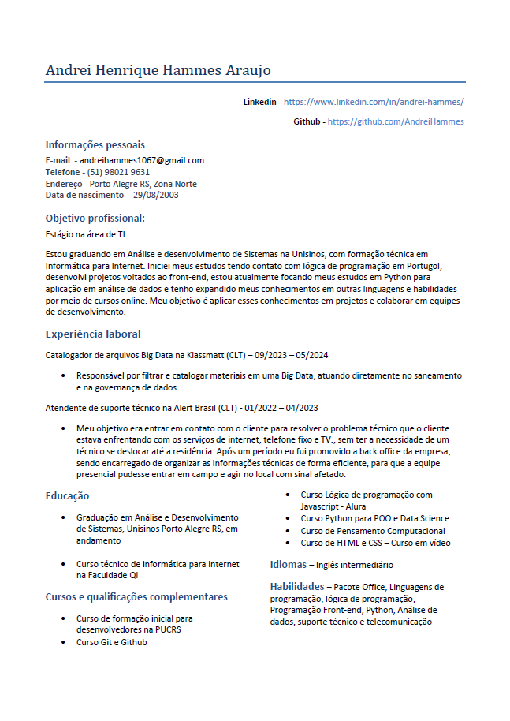

<head>
<link rel="stylesheet" type="text/css" href="style.css">
</head>

<h1 align='center'>Olá, me chamo Andrei Hammes 👋</h1>

 

### Desenvolvedor em formação 😁👨‍💻

 

📚 Olá, atualmente estou buscando oportunidades na área de desenvolvimento. Sou um estudante de programação finalizando um curso técnico presencial de Informática para Internet e realizando uma graduação de análise e desenvolvimento de sistemas na Unisinos. Iniciei meus estudos tendo contato com lógica de programação em portugol , e tenho expandido meus conhecimentos em outras linguagens e habilidades por meio de cursos online. Meu objetivo é aplicar esses conhecimentos em projetos e colaborar em equipes de desenvolvimento.

🖥️🖥️🖥️ Meu atual objetivo é conseguir a minha primeira vaga na área de TI

## Skills
- Python
- Java
- HTML
- CSS
- Javascript
- GIT
- Scrum e Kanban

 

Você pode baixar meu **currículo** em PDF [clicando aqui](./seu-curriculo.pdf). Ou veja uma prévia clicando na miniatura abaixo:

> De uma olhada no meu Curriculo 👀  

## Educação

- **[Graduando em análise e desenvolvimento de sistemas]** - [Unisinos], [Cursando]
- **[Curso técnico de informática para internet]** - [Qi Faculdade e escola técnica], [Completo]

## Contato

- **Email**: [Me mande um email](andreihammes1067@gmail.com)
- **LinkedIn**: [Visite meu linkedin](https://www.linkedin.com/in/andrei-hammes/)
- **Github**: [Meu Github](https://github.com/AndreiHammes)

